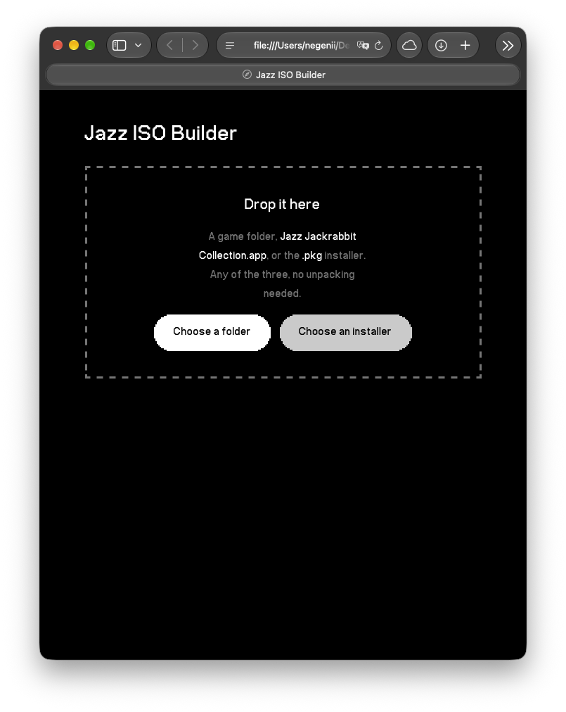
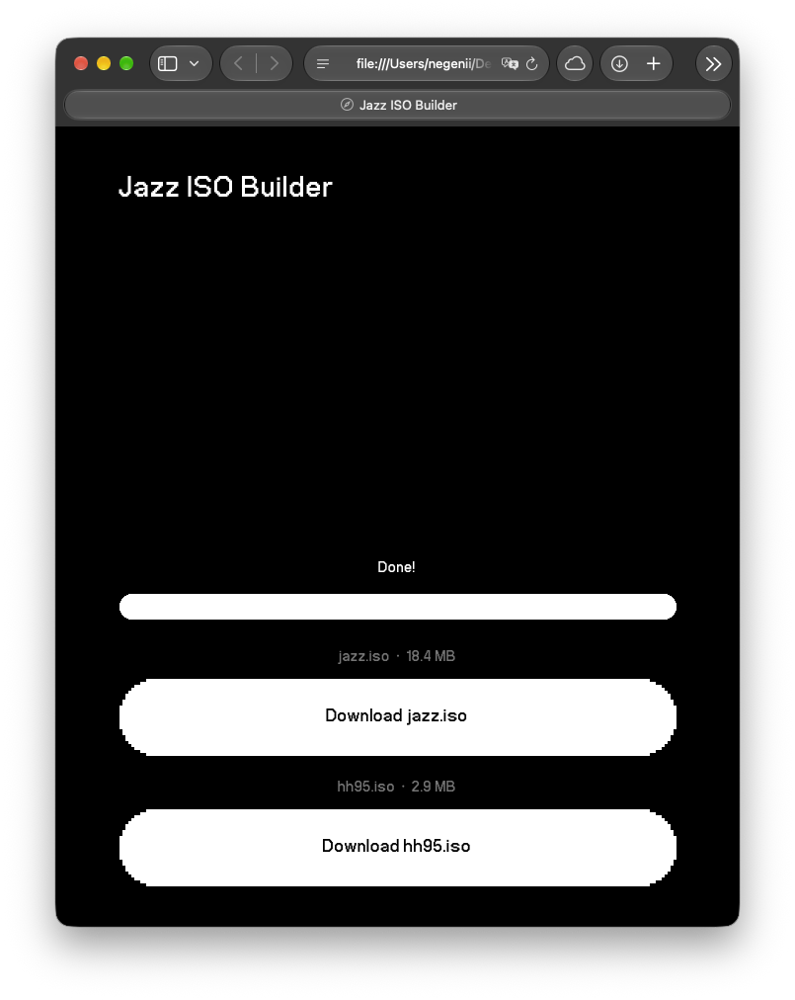

# OpenJazz Pocket

Jazz Jackrabbit 1 running natively on the Analogue Pocket through openfpgaOS.
This is a port of [OpenJazz](https://github.com/AlisterT/openjazz), built
with the [openfpgaOS SDK](https://github.com/openfpgaOS/openfpgaSDK).

Two games run on it: Jazz Jackrabbit and Holiday Hare 95, the standalone
Christmas release from 1995. Each has its own entry in the Pocket's game
list and its own save slots.

## What you need

- An Analogue Pocket on firmware 2.2 or newer, with openFPGA enabled.
- An SD card.
- The data files of Jazz Jackrabbit 1 obtained legally. This
  core contains no game data.

Legal sources for the data files:

- Your own copy of the game, bought from GOG or Steam, or installed from
  original media. Point the tool below at the folder the game lives in.
- The shareware episode, which Epic MegaGames released for free
  distribution. `tools/fetch-shareware.sh` downloads and unpacks it.

Whichever you use, the folder must contain the game's own data files. The
packaging tool checks for `LEVEL0.000`, `MENU.000`, `FONTS.000` and
`PANEL.000` and refuses to build if they are missing, so a wrong folder
fails immediately rather than producing a broken image.

## Install

1. Unzip the release ZIP to the root of your Pocket's SD card. It adds
   `Cores/negenii.OpenJazz/`, `Assets/openjazz/` and
   `Platforms/openjazz.json`; merge with the folders already there.
2. Turn your game files into an image, as described in
   [Building the image](#building-the-image) below. You end up with
   `jazz.iso`, and with `hh95.iso` too if your copy includes Holiday
   Hare 95.
3. Copy `jazz.iso` to `Assets/openjazz/common/` on the SD card, next to
   `openjazz.elf`. If you also have `hh95.iso`, put it in the same folder.
   The core's game list holds an entry for each: "Jazz Jackrabbit" and
   "Holiday Hare 95", each with its own save slots.
4. Eject the card, boot the Pocket, and launch OpenJazz from the openFPGA
   menu.

Saves appear by themselves on first use. If the game data is missing or the
image did not mount, the screen says so instead of failing silently.

Holiday Hare 95 is a separate game, not an add-on. It reuses the world
numbers the main game gives its own Holiday Hare episode, with different
levels, so the two cannot live in one image. That is why each gets its own.

## Building the image

The Pocket loads one file per game, so the game's own files have to be
packed into a single image first. Two tools do it, and both work entirely
on your machine.

### In a browser

Open `tools/jazz-iso.html`. It is one self-contained file: no install, no
server, and it works with the network switched off.

Without cloning anything, the same page is served straight from this
repository:
<https://negenii.github.io/openJazz_pocket/tools/jazz-iso.html>

It is the same file either way. It does its work in your browser and
sends nothing anywhere, which you can check in the source next to it.



Drop any of these on the page:

- the folder your game is installed in,
- `Jazz Jackrabbit Collection.app`, on a Mac, the bundle itself,
- the GOG `.pkg` installer for macOS, without installing it.

The page looks through what you gave it for the folder that holds the
game, so it does not matter how deeply it is buried. Conversion starts on
its own; there is no button to press and nothing to choose.



If your copy holds both games, you get both images in one pass, each
under its own name. Every image is read back and checked before the
download appears, so a half-written one is never offered.

The Windows installer is the one thing the page cannot open. Run it, then
point the page at the folder it installed.

### In a terminal

```
tools/mkjazz.sh <folder-with-your-jazz-files> jazz.iso
```

It builds one image at a time, so for the second game point it at the
`HH95` folder inside your install and name the output `hh95.iso`. It uses
`xorriso`, `mkisofs` or `hdiutil`, whichever it finds.

Whichever you use, the image is built from your own files and is not
something you should redistribute.

## Controls

| Pocket button | Action |
|---|---|
| D-Pad | Move / navigate menus |
| A | Fire / Enter / Yes |
| B | Jump / Swim / No |
| X | Change weapon |
| Y | Pause |
| L | Select blaster |
| R | Select toaster |
| Select | Stats screen |
| Start | Escape / menu |

## Display

Fixed 320x288, the Pocket's 1600x1440 panel at an exact 5x integer scale
with square pixels. The original ran at 320x200 on a 4:3 screen, so menu
and cutscene art looks slightly flatter here. I'm just not exactly keen on
black bars in game.

Cutscenes are the exception. They are 320x200 whatever the screen is, so
they play at that size with a band above and below rather than stretched
to fill the height. Stretching them meant scaling 200 rows into 288, which
duplicates one row in five and shows.

## Saves

The game's own save slots work as in the original and live in the core's
nonvolatile save files.

## Build from source

Needs Docker (the RISC-V toolchain runs in a container) and, for
`make test`, SDL2.

```
git clone --recursive https://github.com/negenii/openJazz_pocket.git
cd src/openjazz
make            # build app.elf, stage build/pocket/openjazz/ (includes jazz.iso if present)
make copy       # copy to the Pocket SD card
make package    # zip a release under releases/pocket/ (no game data)
make test       # desktop SDL2 build, for fast iteration
```

See [docs/SDK-README.md](docs/SDK-README.md) for the SDK's own documentation.

## About this repository

This is a fork of the openfpgaOS SDK, which is how cores for that runtime
are built: the SDK sits at the top level and the port lives in
`src/openjazz/`. OpenJazz itself is a submodule at
`src/openjazz/openjazz/`, pinned to the `openfpga` branch of
[this fork](https://github.com/Negenii/openjazz/tree/openfpga), which adds
the openfpgaOS platform files and two small fixes on top of upstream.
The SDK's own documentation is in [docs/SDK-README.md](docs/SDK-README.md).

Directories worth knowing:

| Path | What it holds |
|---|---|
| `src/openjazz/` | the port: build rules and the SDL compatibility layer |
| `src/openjazz/openjazz/` | OpenJazz, as a submodule |
| `dist/openjazz/` | the core's static files: JSON, icon, platform art |
| `tools/jazz-iso.html` | the same thing in a browser, by drag and drop |
| `tools/mkjazz.sh` | builds `jazz.iso` from your game files |
| `tools/mkart.py` | converts the core icon and platform banner to and from PNG |
| `docs/RELEASING.md` | how a release and a catalogue listing are made |

## Licence

OpenJazz is GPL-2.0, so the built core is GPL-2.0 as well, and the sources
this port adds are offered under the same terms. The openfpgaOS SDK parts
of this tree remain under their own Apache-2.0 licence, and the prebuilt
runtime under `runtime/` carries the third-party terms described in
[NOTICE](NOTICE).

## Credits

- [OpenJazz](https://github.com/AlisterT/openjazz) by Alister Thomson and
  contributors, GPL-2.0.
- [openfpgaOS SDK](https://github.com/openfpgaOS/openfpgaSDK) by
  ThinkElastic, Apache-2.0.
- Jazz Jackrabbit is a trademark of Epic Games, and the game is (c) Epic
  MegaGames. This project is not affiliated with or endorsed by them, ships
  no game data, and uses the name only to say which game it plays.

## Important note

- RABBITS STINK
